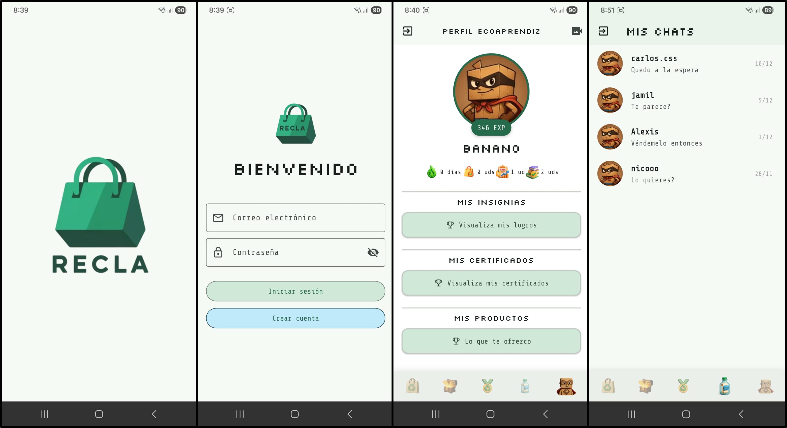
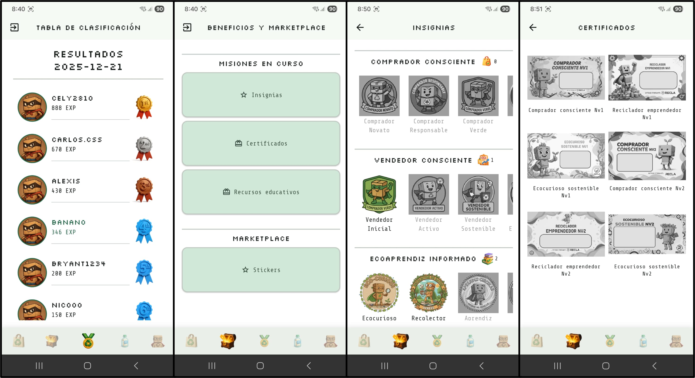
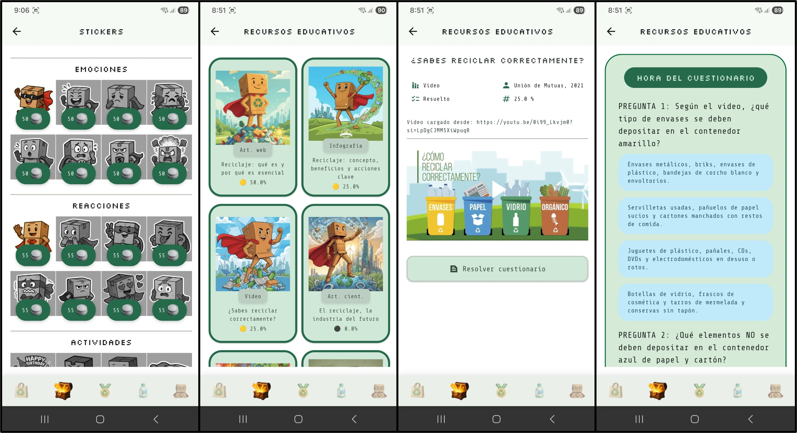
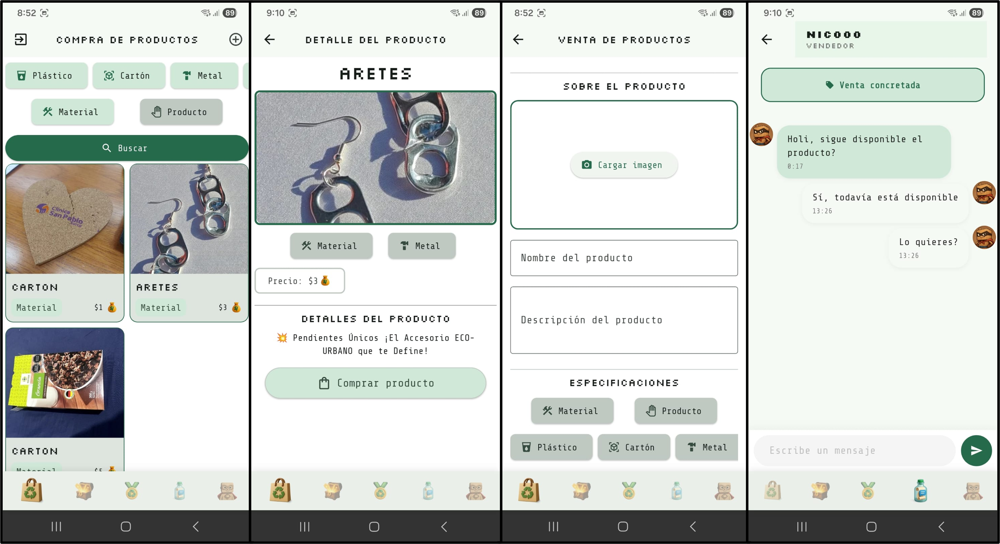

# RECLA - APLICACIÓN MÓVIL PARA ECOAPRENDICES

## 1. Descripción del proyecto
RECLA es una plataforma que implementa mecanismos de gamificación para promover la adopción del hábito de reciclaje en los ciudadanos limeños. De esta manera, buscar aportar al logro de las ODS 12 (Producción y consumo responsables) y 13 (Acción por el clima) de la Agenda 2030. En este repositorio se presenta la aplicación móvil destinada a ser usada por los ecoaprendices (modelos, providers, servicios, screens).







## 2. Estado del proyecto


## 3. Tecnologías utilizadas


## 4. Guía de instalación
1. Clonar el repositorio en su IDE:
    ```
    https://github.com/caroSeminario23/RECLA_frontend_v2.git
    ```

2. Conectar los microservicios desplegados mediante la configuración de las variables del archivo: **lib\utils\servicios_externos.dart**

3. Para probar la app en modo prueba, digitar el siguiente comando en la terminal:
   ```
   flutter run
   ```

   Para generar el apk de la aplicación ejecutar el siguiente comando:
   ```
   flutter build apk --release --split-per-abi
   ```


## 5. Licencia
[](./LICENSE)

## 6. Repositorios asociados
- [Microservicio usuarios](https://github.com/caroSeminario23/RECLA_servicio_usuarios)
- [Microservicio gamificación](https://github.com/caroSeminario23/RECLA_servicio_gamificacion)
- [Microservicio compraventa](https://github.com/caroSeminario23/RECLA_servicio_compraventa)
- [Scripts para bases de datos y cluster de imágenes](https://github.com/caroSeminario23/RECLA_V2)